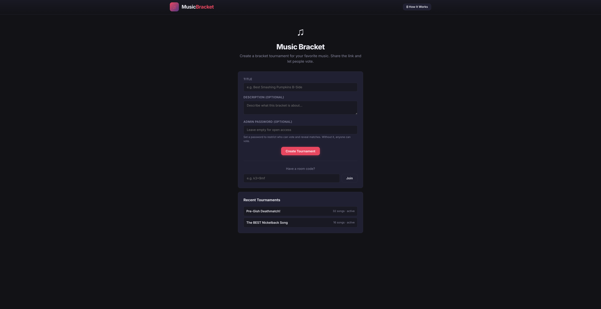
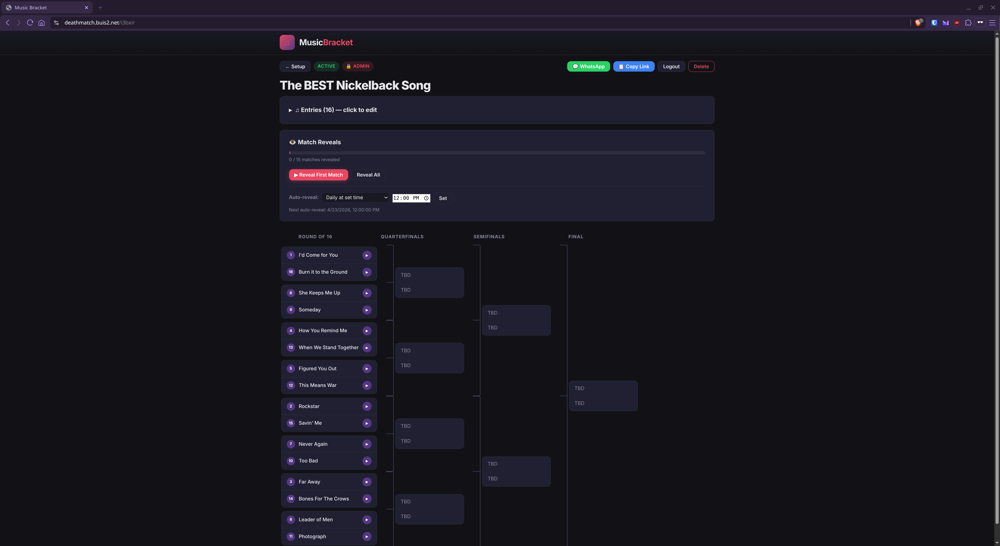

# Music Bracket

A self-hosted single-elimination bracket tournament app for music — run "Best Song" style competitions in WhatsApp groups with YouTube audio playback, match-by-match reveals, and admin-controlled voting.


## Screenshots

**Home page — Create or join a tournament:**



**Bracket view — Match reveals with audio playback:**



## Features

- **Single-elimination brackets** — 4, 8, 16, or 32 entries with sequential seeding
- **YouTube audio playback** — play songs head-to-head with embedded player
- **Match-by-match reveals** — admin reveals one matchup at a time; entries stay hidden until revealed
- **Auto-reveal timer** — set a daily time (e.g. 12:00 PM) and matches reveal automatically on schedule
- **Admin password protection** — auto-generated memorable passwords (e.g. `bold-track-47`) restrict voting and reveals to those who have it
- **Share links** — WhatsApp and copy-link buttons; "Copy Link + Password" copies everything in one click
- **Link previews** — Open Graph meta tags so shared links show the tournament name
- **Edit entries** — admins can rename songs and update YouTube URLs at any time
- **YouTube link preview** — pasted links show a live thumbnail and title before you save, so you can confirm you've got the right song; supports watch/share links, Shorts, YouTube Music, and bare video IDs
- **Bulk import** — paste multiple songs at once (`Name | YouTube URL` per line), with live per-line validation before import
- **Bracket restart** — reset all matches while keeping entries in draft mode
- **PNG export** — export the bracket as a screenshot image
- **No accounts needed** — anyone with the link can view; password is optional
- **Searchable, categorized FAQ** — the "How It Works" guide is grouped by topic with a live search box
- **Version footer** — a small badge in the corner shows the running version and pops open a changelog

## Quick Start

### Docker Compose (recommended)

```yaml
services:
  music-bracket:
    image: ryaneford/music-bracket:latest
    container_name: music-bracket
    ports:
      - "3211:3000"
    volumes:
      - ./data:/app/data
    restart: unless-stopped
```

```bash
docker compose up -d
```

Open `http://localhost:3211` and start creating brackets.

### Docker Run

```bash
docker run -d \
  --name music-bracket \
  -p 3211:3000 \
  -v ./data:/app/data \
  --restart unless-stopped \
  ryaneford/music-bracket:latest
```

### From Source

```bash
git clone https://github.com/ryaneford/music-bracket.git
cd music-bracket/app
npm install
node server.js
```

The app runs on port 3000 by default. Set `PORT` environment variable to change.

## Configuration

| Variable | Default | Description |
|----------|---------|-------------|
| `PORT` | `3000` | HTTP port to listen on |

Data is stored in `./data/brackets.db` (SQLite). Mount the `data` directory as a volume to persist tournaments across container restarts.

## Usage

### Creating a Tournament

1. Enter a title and optional description
2. A password is auto-generated — share it with your group so they can vote
3. Click **Create Tournament** — you'll get a shareable link, room code, and password

### Adding Entries

1. On the setup page, add song names and YouTube URLs — a thumbnail and title preview appears as you paste a link so you can confirm it's the right video
2. Entries can be dragged to reorder seeding (or auto-seeded by entry order)
3. Click **Start Tournament** when ready

### Running a Bracket

- Matches are revealed one at a time — each reveal shows two songs and their audio players
- Pick a winner before revealing the next match
- **Auto-reveal** can be set to a daily time (e.g. 12:00 PM) so matches reveal on schedule
- Users without the password see the bracket read-only — hidden matches show as "???"

### Sharing

- Use the **WhatsApp** or **Copy Link** button on the bracket page
- Share the password too — it's the only way your group can vote
- Anyone with the link can view the bracket; the password is needed to vote

## FAQ

### What is a music bracket?

A single-elimination tournament where songs go head-to-head in matchups. You listen to two tracks, vote for your favorite, and the winner advances to the next round until only one song remains.

### How do I create a tournament?

Enter a title, then add your songs. Click **Start Tournament** and you'll get a shareable link, room code, and an auto-generated password to hand out to your group.

### How do I add songs and YouTube links?

Add them one at a time, or open **Bulk Import** and paste a whole list at once (`Song Name | YouTube URL`, one per line). As you paste a link, a thumbnail and title preview appears so you can confirm it's the right video before saving — a YouTube link isn't required, songs can play with no audio too.

### What if I don't have a power-of-2 number of songs?

No problem — with, say, 6 or 11 entries, the top seeds automatically get a first-round bye so the bracket still fills out to the next size up (8, 16, 32...). Use **Shuffle** before starting if you want random seeding instead of entry order.

### What does the password do?

A password is auto-generated when you create a bracket. It's the only way to add songs, reveal matches, vote, and edit the tournament — share it with your group and don't lose it.

### How do match reveals work?

Matches start hidden. Reveal one matchup at a time — each reveal shows two songs and their audio. Pick a winner before revealing the next match. This is great for running a group listening session where everyone discovers each pairing together.

### Does auto-reveal work?

Yes — set a daily time (e.g. 12:00 PM) and one match reveals automatically each day at that time. You still need to pick a winner before the next one reveals.

### Can I edit songs after starting?

Yes — anyone with the password can rename songs or update YouTube links at any time by clicking the pen icon next to an entry, even mid-tournament.

### Can I restart or reset a bracket?

Yes — admins can restart a tournament, which clears all matches and reveals but keeps your entries, so you can reshuffle and run it again from the draft stage.

### How do I share the bracket?

Use the **WhatsApp** or **Copy Link** button on the bracket page. Anyone with the link can view; share the password too since it's the only way your group can vote.

### Can I export the bracket as an image?

Yes — use the **Export** button on the bracket page to save the current bracket view as a PNG, handy for posting to a group chat.

### Can I log out?

Yes — click the **Logout** button in the bracket header. You can log back in with the password at any time.

## Reverse Proxy

To use with a custom domain (e.g. `brackets.example.com`), add a reverse proxy like Caddy or Nginx:

**Caddy example:**

```
brackets.example.com {
    reverse_proxy localhost:3211
}
```

**Nginx example:**

```nginx
server {
    listen 443 ssl;
    server_name brackets.example.com;

    location / {
        proxy_pass http://127.0.0.1:3211;
        proxy_set_header Host $host;
        proxy_set_header X-Real-IP $remote_addr;
    }
}
```

## License

MIT

## Disclaimer

This project was fully coded using AI (opencode + GLM-5). No manual code was written — the entire application was generated through conversational AI prompts.

**Built with:** Node.js, Express, better-sqlite3, bcryptjs, Vanilla JS, YouTube IFrame API, Docker